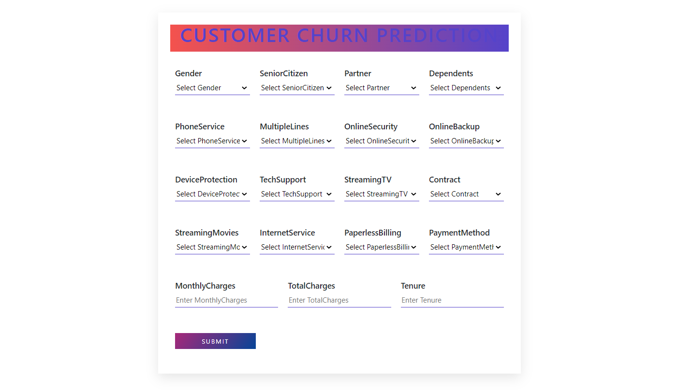

  

_________________

**Web App Link**

 <a href="https://mycustomerchurn.herokuapp.com/"> https://mycustomerchurn.herokuapp.com/ </a> 

_________________

## About Dataset

**Context**

Predict behavior to retain customers. You can analyze all relevant customer data and develop focused customer retention programs.

**Content**

Each row represents a customer, each column contains customer’s attributes described on the column Metadata.

**The data set includes information about:**

* Customers who left within the last month – the column is called Churn
* Services that each customer has signed up for – phone, multiple lines, internet, online security, online backup, device protection, tech support, and streaming TV and movies
* Customer account information – how long they’ve been a customer, contract, payment method, paperless billing, monthly charges, and total charges
* Demographic info about customers – gender, age range, and if they have partners and dependents

____________________

**About Web App**

* Web app is build using Flask and deployed on Heroku.

  

* Fill all the input boxes and click on submit button to know whether the customer will churn on not.

_____________________

**Details Description of Dataset**

* **Churn Value:** 1 = the customer left the company this quarter. 0 = the customer remained with the company. Directly related to Churn Label.

* **CustomerID:** A unique ID that identifies each customer.

* **Gender:** The customer’s gender: Male, Female

* **Senior Citizen:** Indicates if the customer is 65 or older: Yes, No

* **Dependents:** Indicates if the customer lives with any dependents: Yes, No. Dependents could be children, parents, grandparents, etc.

* **Tenure in Months:** Indicates the total amount of months that the customer has been with the company by the end of the quarter specified above.

* **Partner:** Indicates if the customer is married: Yes, No

* **Phone Service:** Indicates if the customer subscribes to home phone service with the company: Yes, No

* **Multiple Lines:** Indicates if the customer subscribes to multiple telephone lines with the company: Yes, No

* **Internet Service:** Indicates if the customer subscribes to Internet service with the company: No, DSL, Fiber Optic, Cable.

* **Online Security:** Indicates if the customer subscribes to an additional online security service provided by the company: Yes, No

* **Online Backup:** Indicates if the customer subscribes to an additional online backup service provided by the company: Yes, No

* **Contract:** Indicates the customer’s current contract type: Month-to-Month, One Year, Two Year.

* **Paperless Billing:** Indicates if the customer has chosen paperless billing: Yes, No

* **Payment Method:** Indicates how the customer pays their bill: Bank Withdrawal, Credit Card, Mailed Check

* **Monthly Charge:** Indicates the customer’s current total monthly charge for all their services from the company.

* **Total Charges:** Indicates the customer’s total charges, calculated to the end of the quarter specified above.

* **Streaming TV:** Indicates if the customer uses their Internet service to stream television programing from a third party provider: Yes, No. The company does not charge an additional fee for this service.

* **Streaming Movies:** Indicates if the customer uses their Internet service to stream movies from a third party provider: Yes, No. The company does not charge an additional fee for this service.

_______________________________

**Thank you**

